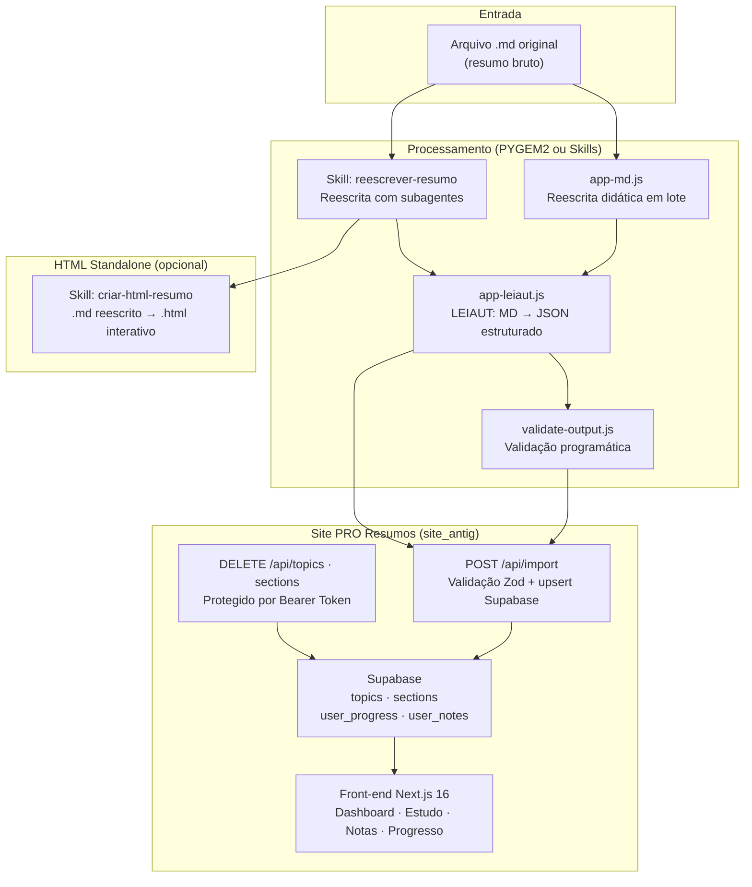

# Ecossistema PRO Resumos

> Atualizado em 10/07/2026  
> Visão unificada do pipeline de produção de conteúdo para o site PRO Resumos.

## Componentes

O ecossistema é formado por três grupos de ferramentas que operam em sequência:

| Componente | Diretório | Função |
|---|---|---|
| **Skills do agente** | `C:\PRORESUMOS` | Reescrita com subagentes e conversão para HTML standalone |
| **PYGEM2** | `C:\PYGEM2` | Reescrita didática em lote e conversão MD → JSON estruturado (LEIAUT) |
| **Site PRO Resumos** | `C:\site_antig` | API de importação, banco Supabase e front-end de estudo |

## Pipeline completo



### Caminhos do fluxo

1. **Fluxo principal (PYGEM2)**: `.md` → `app-md.js` → `.md reescrito` → `app-leiaut.js` → `JSON` → `POST /api/import` → Supabase → Site
2. **Fluxo com skills**: `.md` → Skill `reescrever-resumo` → `.md reescrito` → `app-leiaut.js` → `JSON` → `POST /api/import` → Site
3. **Fluxo HTML standalone**: `.md reescrito` → Skill `criar-html-resumo` → `.html` (independente do site)

## Contrato de dados: JSON de importação

O JSON gerado pelo LEIAUT e consumido pela API do site segue este formato:

```typescript
{
  topic_id: string;         // Hífens, minúsculas, sem acentos
  discipline?: string;      // Inferida do conteúdo; default "Geral"
  topic_title: string;      // Título exibido no dashboard
  sections: Array<{
    section_id: string;     // Formato: {topic_id}-sec-NN
    title: string;          // Título no índice lateral
    content_markdown: string;
    callouts: Array<{ type: "warning" | "info" | "tip"; title: string; text: string }>;
    mnemonics: Array<{ key: string; meaning: string; description: string }>;
    flashcards: Array<{ question: string; answer: string }>;
    mermaid_mindmap: string; // Código Mermaid puro (sem cercas ```)
  }>;
}
```

**Fonte autoritativa**: o Zod schema em `C:\site_antig\src\app\api\import\route.ts` é a validação final. O schema Gemini no LEIAUT (`C:\PYGEM2\src\app-leiaut.js`) deve gerar output compatível.

## Disciplinas canônicas

A lista abaixo é a referência única para grafias padronizadas. Usar a grafia exata evita duplicação de grupos no dashboard.

| Disciplina | Categoria |
|---|---|
| `Direito Constitucional` | Jurídica |
| `Direito Administrativo` | Jurídica |
| `Direito Penal` | Jurídica |
| `Direito Civil` | Jurídica |
| `Direito Processual Civil` | Jurídica |
| `Direito Processual Penal` | Jurídica |
| `Direito do Trabalho` | Jurídica |
| `Direito Tributário` | Jurídica |
| `Direito Empresarial` | Jurídica |
| `Legislação Especial` | Jurídica |
| `Administração Financeira e Orçamentária` | Não jurídica |
| `Contabilidade` | Não jurídica |
| `Administração` | Não jurídica |
| `Economia` | Não jurídica |
| `Português` | Não jurídica |
| `Matemática` | Não jurídica |
| `Raciocínio Lógico` | Não jurídica |
| `Informática` | Não jurídica |
| `Geral` | Default |

Novas disciplinas podem ser adicionadas. A API aceita qualquer string. A normalização no LEIAUT (`validateAndNormalizeOutput`) corrige variações de caixa/espaçamento das disciplinas listadas acima.

## Convenções de IDs

| Campo | Regra | Exemplo |
|---|---|---|
| `topic_id` | Minúsculas, sem acentos, hífens | `dir-constitucional-art-5` |
| `section_id` | `{topic_id}-sec-NN` (NN = 01, 02...) | `dir-constitucional-art-5-sec-01` |

- **Nunca** usar underscores (`_`); o LEIAUT normaliza para hífens.
- IDs devem ser **globalmente únicos** no banco.
- Reutilizar um `section_id` existente causa **upsert** (sobrescrita intencional).

## Mermaid

O LEIAUT gera diagramas Mermaid que são renderizados no front-end. Regras:

- Apenas código puro, sem cercas `` ```mermaid `` ``.
- Tipos suportados: `flowchart TD`/`TB`, `graph TD`/`TB`. Mindmaps são convertidos para flowchart.
- Tipos proibidos: `pie`, `stateDiagram-v2`, `sequenceDiagram`, `classDiagram` (convertidos automaticamente).
- Renderização no site é client-only (`next/dynamic` com `ssr: false`).

## Documentação por projeto

### PYGEM2 (`C:\PYGEM2`)

| Documento | Propósito |
|---|---|
| `README.md` | Visão geral, instalação, uso, variáveis de ambiente |
| `AGENTS.md` | Regras obrigatórias para agentes de IA |
| `SECURITY.md` | Política de segurança e credenciais |
| `PLANO_ADEQUACAO_LEIAUT.md` | Registro histórico (concluído) |

### Site PRO Resumos (`C:\site_antig`)

| Documento | Propósito |
|---|---|
| `README.md` | Visão geral, stack, estrutura, comandos |
| `AGENTS.md` | Regras obrigatórias para agentes de IA |
| `ECOSSISTEMA.md` | Este documento — visão unificada do pipeline |
| `PROXIMOS_PASSOS_SITE.md` | **Fonte única** de estado atual e roadmap |
| `guia_envio_materiais.md` | Guia operacional para preparar e enviar materiais |
| `supabase/migrations/*` | Schema e políticas do banco |

### Skills (`C:\Users\Naussen\.gemini\config\skills`)

| Skill | Propósito |
|---|---|
| `reescrever-resumo` | Reescrita com subagentes paralelos (.md → .md) |
| `criar-html-resumo` | Conversão para HTML standalone (.md → .html) |

## Segurança — Responsabilidades por componente

| Componente | Segredo | Onde usar |
|---|---|---|
| PYGEM2 | `GEMINI_API_KEY` | Apenas em `.env`, nunca em código ou logs |
| Site — cliente | `NEXT_PUBLIC_SUPABASE_URL`, `NEXT_PUBLIC_SUPABASE_ANON_KEY` | Client Components (seguro) |
| Site — servidor | `SUPABASE_SERVICE_ROLE_KEY` | Route Handlers, Server Actions, scripts (nunca no cliente) |

## Verificação cruzada

Ao alterar o contrato JSON (em qualquer lado):

1. Verificar schema Gemini em `C:\PYGEM2\src\app-leiaut.js` (`responseSchema`)
2. Verificar Zod schema em `C:\site_antig\src\app\api\import\route.ts`
3. Verificar `validate-output.js` em `C:\PYGEM2`
4. Verificar `guia_envio_materiais.md` em `C:\site_antig`
5. Atualizar este documento se disciplinas ou campos mudarem
