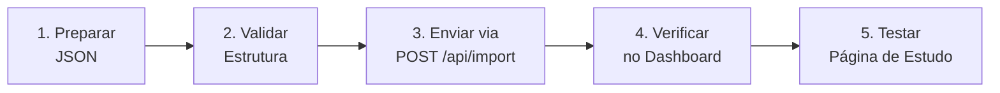

# Guia de Envio de Materiais — PRO Resumos

> Guia operacional completo para criar, validar e enviar novos materiais de estudo ao site.

---

## Visão Geral do Fluxo



---

## Passo 1 — Preparar o JSON

### 1.1 Definir Disciplina e Tópico

Escolha a **disciplina** e o **título do tópico** que você quer publicar. A disciplina agrupa os tópicos no dashboard.

**Disciplinas padronizadas** (use exatamente esta grafia):

| Disciplina | Observação |
|---|---|
| `Direito Constitucional` | Garantias fundamentais, organização do Estado |
| `Direito Administrativo` | Atos administrativos, licitações, servidores |
| `Direito Penal` | Parte geral e especial |
| `Direito Civil` | Obrigações, contratos, família |
| `Direito Processual Civil` | CPC, procedimentos |
| `Direito Processual Penal` | CPP, inquérito, ação penal |
| `Direito do Trabalho` | CLT, relações trabalhistas |
| `Direito Tributário` | CTN, impostos, contribuições |
| `Direito Empresarial` | Sociedades, falência |
| `Legislação Especial` | Estatutos, leis orgânicas |
| `Administração Financeira e Orçamentária` | AFO, orçamento público, LRF |
| `Contabilidade` | Balanço patrimonial, DRE |
| `Administração` | Administração geral e pública |
| `Economia` | Micro, macro, economia do setor público |
| `Português` | Gramática, sintaxe, morfologia |
| `Matemática` | Porcentagem, equações, probabilidade |
| `Raciocínio Lógico` | Lógica proposicional, diagramas |
| `Informática` | Segurança da informação, hardware, software |
| `Geral` | Valor padrão, se não especificado |

> [!WARNING]
> Se você digitar `"Direito constitucional"` (minúsculo) em vez de `"Direito Constitucional"`, o dashboard criará **dois grupos diferentes**. Copie o texto exato da tabela acima.

### 1.2 Criar IDs únicos

| Campo | Formato | Exemplo |
|---|---|---|
| `topic_id` | `disciplina-assunto` | `dir-constitucional-art-5` |
| `section_id` | `topic_id-sec-NN` | `dir-constitucional-art-5-sec-01` |

**Regras para IDs:**
- Somente letras minúsculas, números e hífens (`-`)
- Sem espaços, acentos ou caracteres especiais
- Cada ID deve ser **globalmente único** em todo o banco

> [!CAUTION]
> Se você reutilizar um `section_id` que já existe (mesmo de outro tópico), o conteúdo antigo será **sobrescrito** pelo upsert. Isso é intencional para atualizações, mas cuidado com colisões acidentais.

### 1.3 Escrever o conteúdo das seções

Cada seção contém até 6 campos de conteúdo:

| Campo | Tipo | Obrigatório | Descrição |
|---|---|---|---|
| `section_id` | string | ✅ | ID único da seção |
| `title` | string | ✅ | Título exibido no índice lateral |
| `content_markdown` | string | ❌ | Corpo do conteúdo em Markdown |
| `callouts` | array | ❌ | Alertas visuais (warning/info/tip) |
| `mnemonics` | array | ❌ | Mnemônicos de memorização |
| `flashcards` | array | ❌ | Pares pergunta/resposta |
| `mermaid_mindmap` | string | ❌ | Código Mermaid de mapa mental |

---

## Passo 2 — Montar o JSON

### Template Completo

```json
{
  "topic_id": "dir-constitucional-art-5",
  "discipline": "Direito Constitucional",
  "topic_title": "Art. 5º — Direitos e Garantias Fundamentais",
  "sections": [
    {
      "section_id": "dir-constitucional-art-5-sec-01",
      "title": "Princípio da Igualdade (Inciso I)",
      "content_markdown": "## Igualdade Formal e Material\n\nO inciso I do art. 5º da CF/88 estabelece que **homens e mulheres são iguais em direitos e obrigações**, nos termos desta Constituição.\n\n### Igualdade Formal\nTratamento idêntico perante a lei, sem distinções.\n\n### Igualdade Material\nTratar os desiguais na medida de suas desigualdades — é o fundamento das **ações afirmativas**.",
      "callouts": [
        {
          "type": "warning",
          "title": "⚠️ Pegadinha de Prova",
          "text": "A igualdade do art. 5º, I, NÃO é absoluta. O próprio texto diz 'nos termos desta Constituição', admitindo distinções constitucionais (ex: aposentadoria diferenciada)."
        },
        {
          "type": "tip",
          "title": "💡 Dica do Professor",
          "text": "Quando a banca perguntar sobre 'isonomia', lembre-se: ela tem DUAS dimensões (formal e material). Sempre analise qual dimensão está sendo cobrada."
        }
      ],
      "mnemonics": [
        {
          "key": "IF-IM",
          "meaning": "Igualdade Formal — Igualdade Material",
          "description": "IF = Idêntico para todos (Formal). IM = Individualizado por Mérito/necessidade (Material)."
        }
      ],
      "flashcards": [
        {
          "question": "Qual a diferença entre igualdade formal e material?",
          "answer": "Formal: todos são iguais perante a lei. Material: tratar desiguais de forma desigual na medida de suas desigualdades."
        },
        {
          "question": "O princípio da igualdade do art. 5º, I, é absoluto?",
          "answer": "Não. A própria CF admite distinções, como aposentadoria diferenciada por gênero e serviço militar obrigatório apenas para homens."
        }
      ],
      "mermaid_mindmap": "mindmap\n  root((Art. 5º, I))\n    Igualdade Formal\n      Mesma lei para todos\n      Sem distinções\n    Igualdade Material\n      Tratar desiguais desigualmente\n      Ações Afirmativas\n    Limitações\n      Aposentadoria\n      Serviço Militar"
    },
    {
      "section_id": "dir-constitucional-art-5-sec-02",
      "title": "Princípio da Legalidade (Inciso II)",
      "content_markdown": "## Ninguém será obrigado a fazer ou deixar de fazer alguma coisa senão em virtude de lei\n\nEste é o **princípio da legalidade** na perspectiva do particular...",
      "callouts": [],
      "mnemonics": [],
      "flashcards": [
        {
          "question": "Qual a diferença entre legalidade para o particular e para a administração pública?",
          "answer": "Particular: pode tudo que a lei não proíbe. Administração: só pode o que a lei expressamente autoriza."
        }
      ],
      "mermaid_mindmap": ""
    }
  ]
}
```

### Template Mínimo (só o obrigatório)

```json
{
  "topic_id": "meu-novo-topico",
  "topic_title": "Título do Meu Tópico",
  "sections": [
    {
      "section_id": "meu-novo-topico-sec-01",
      "title": "Primeira Seção",
      "content_markdown": "Conteúdo em **Markdown** aqui..."
    }
  ]
}
```

> [!NOTE]
> Se `discipline` for omitido, será salvo como `"Geral"`. Arrays vazios (`callouts`, `mnemonics`, `flashcards`) e strings vazias (`mermaid_mindmap`) podem ser omitidos — o Zod aplicará os defaults automaticamente.

---

## Passo 3 — Validar o JSON

Antes de enviar, certifique-se de que o JSON é válido:

### Opção A: Via terminal (jq)
```bash
cat material.json | jq .
```
Se o JSON estiver malformado, `jq` reportará o erro com a linha exata.

### Opção B: Via VS Code
Cole o conteúdo num arquivo `.json` e o editor marcará erros de sintaxe em vermelho.

### Validações automáticas da API

A API aplica as seguintes regras (via Zod):

| Regra | O que acontece se violada |
|---|---|
| `topic_id` vazio | Erro 400: `"String must contain at least 1 character(s)"` |
| `topic_title` vazio | Erro 400: idem |
| `sections` vazio (array sem itens) | Erro 400: `"Pelo menos uma seção é obrigatória"` |
| `section_id` vazio | Erro 400: campo obrigatório |
| `callouts[].type` inválido | Erro 400: deve ser `"warning"`, `"info"` ou `"tip"` |

---

## Passo 4 — Enviar para a API

### Via cURL (terminal)

```bash
curl -X POST http://localhost:3000/api/import \
  -H "Content-Type: application/json" \
  -d @material.json
```

### Via cURL (produção)

```bash
curl -X POST https://seu-dominio.com/api/import \
  -H "Content-Type: application/json" \
  -d @material.json
```

### Via PowerShell (Windows)

```powershell
$json = Get-Content -Raw material.json
Invoke-RestMethod -Uri "http://localhost:3000/api/import" -Method POST -ContentType "application/json" -Body $json
```

### Resposta de Sucesso (201)

```json
{
  "message": "Importação concluída com sucesso",
  "topic_id": "dir-constitucional-art-5",
  "sections_count": 2
}
```

---

## Passo 5 — Verificar no Site

1. Abra o **Dashboard** (`/dashboard`) e confirme que o tópico aparece no card da disciplina correta.
2. Clique no tópico para abrir a **Página de Estudo** e verifique:
   - ✅ Todas as seções aparecem no índice lateral
   - ✅ O conteúdo Markdown renderiza corretamente
   - ✅ Callouts exibem os ícones e cores certas
   - ✅ Mnemônicos aparecem com seus cartões
   - ✅ Flashcards funcionam (clique para virar)
   - ✅ Mapa mental Mermaid renderiza

---

## Operações Especiais

### Atualizar material existente

Basta reenviar o JSON com os **mesmos IDs** (`topic_id` e `section_id`). O upsert substitui o conteúdo automaticamente.

```bash
# Mesmo comando — o upsert cuida da atualização
curl -X POST http://localhost:3000/api/import \
  -H "Content-Type: application/json" \
  -d @material_atualizado.json
```

### Adicionar seções a um tópico existente

Envie um JSON com o **mesmo `topic_id`** mas com novas seções (novos `section_id`). As seções antigas permanecem intactas — apenas as novas são inseridas.

> [!WARNING]
> O `sort_order` é recalculado pelo **índice do array**. Se você reenviar apenas as seções novas, elas terão `sort_order` 0, 1, 2... e podem se misturar com as antigas. Para reordenar corretamente, envie **todas** as seções do tópico no array.

### Remover seções ou tópicos

O site possui endpoints administrativos protegidos para exclusão. Ambos exigem o header `Authorization: Bearer <SUPABASE_SERVICE_ROLE_KEY>`.

#### Deletar um tópico inteiro (cascade remove seções, notas e progresso)

```bash
curl -X DELETE http://localhost:3000/api/topics/dir-constitucional-art-5 \
  -H "Authorization: Bearer $SUPABASE_SERVICE_ROLE_KEY"
```

#### Deletar uma seção específica

```bash
curl -X DELETE http://localhost:3000/api/sections/dir-constitucional-art-5-sec-02 \
  -H "Authorization: Bearer $SUPABASE_SERVICE_ROLE_KEY"
```

#### Via PowerShell (Windows)

```powershell
$headers = @{ "Authorization" = "Bearer $env:SUPABASE_SERVICE_ROLE_KEY" }
Invoke-RestMethod -Uri "http://localhost:3000/api/topics/dir-constitucional-art-5" -Method DELETE -Headers $headers
```

> [!CAUTION]
> Esses endpoints usam a service role key. Nunca exponha essa chave no front-end ou em scripts públicos. A exclusão de tópicos é cascata: remove todas as seções, notas e progresso vinculados.

---

## Checklist Final de Envio

Use esta checklist antes de cada envio:

```
PRÉ-ENVIO
─────────
[ ] topic_id é único, descritivo, sem espaços/acentos
[ ] discipline está na grafia EXATA da tabela padronizada
[ ] topic_title é claro e conciso
[ ] Cada section_id começa com o topic_id como prefixo
[ ] Cada section_id é único em todo o banco
[ ] Nenhum section_id colide com seções de outros tópicos
[ ] content_markdown usa sintaxe Markdown válida
[ ] callouts usam type: "warning" | "info" | "tip"
[ ] flashcards têm question E answer preenchidos
[ ] mnemonics têm key, meaning E description preenchidos
[ ] mermaid_mindmap usa sintaxe Mermaid mindmap válida
[ ] JSON validado (jq, VS Code, ou outro parser)

ENVIO
─────
[ ] Servidor dev rodando (npm run dev) OU usando URL de produção
[ ] Enviado via POST /api/import com Content-Type: application/json
[ ] Resposta retornou status 201 com sections_count correto

PÓS-ENVIO
──────────
[ ] Tópico aparece no Dashboard na disciplina correta
[ ] Todas as seções carregam na página de estudo
[ ] Markdown renderiza sem erros visuais
[ ] Callouts, flashcards e mnemônicos funcionam
[ ] Mapa mental renderiza (se fornecido)
[ ] Notas e progresso funcionam na nova seção
```

---

## Erros Comuns e Soluções

| Erro | Causa Provável | Solução |
|---|---|---|
| **400** — `"Formato inválido"` | JSON malformado ou campo obrigatório faltando | Verifique a saída de `details` na resposta. Corrija o campo indicado |
| **400** — `"Pelo menos uma seção"` | Array `sections` está vazio | Adicione ao menos 1 seção |
| **500** — `"Erro ao salvar tópico"` | Problema no Supabase (conexão, permissão) | Verifique as variáveis de ambiente `NEXT_PUBLIC_SUPABASE_URL` e `SUPABASE_SERVICE_ROLE_KEY` |
| **500** — `"duplicate key"` | `section_id` duplicado dentro do mesmo envio | Garanta que cada `section_id` no array seja único |
| Tópico aparece em disciplina errada | Grafia diferente no campo `discipline` | Compare com a tabela padronizada acima |
| Seções fora de ordem | `sort_order` conflitante | Reenvie todas as seções do tópico no array, na ordem desejada |
